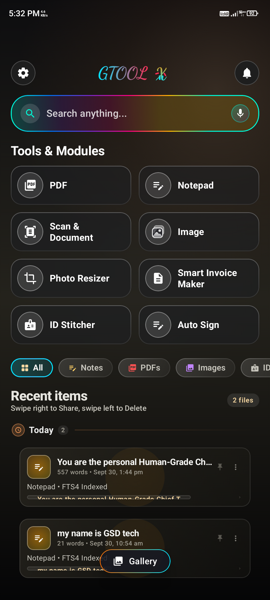
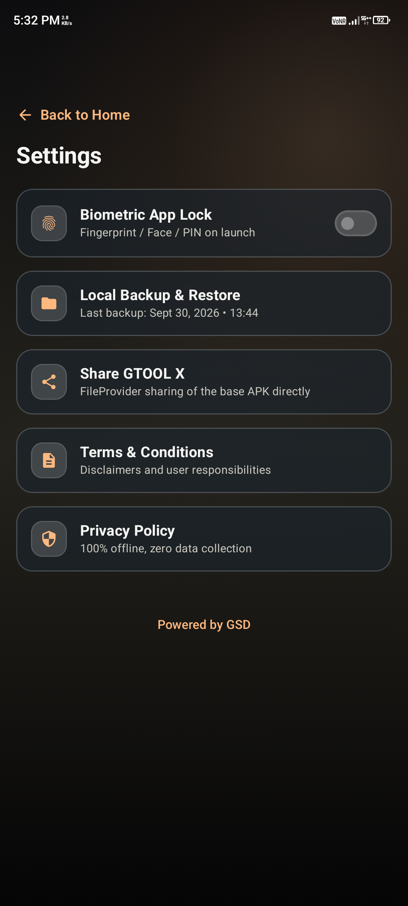

# GTOOL X

### The All-in-One Offline Document & Productivity Powerhouse.

--

### [Direct Download Link (Click Here)](https://github.com/toonatech-del/GTOOL-X/releases/latest/download/GtoolX-Release.apk)

---

## 📱 Direct APK & Source Code Updates

Join our official Telegram community for instant access to latest builds, clean offline utility tools, and source code packages:

👉 **[Join @GSDSourceCode on Telegram](https://t.me/sellapkcode)**

* 🚀 100% Offline APK Drops
* 📦 Verified Releases (Zero Ads, No Shady Links)
* 💻 Ready-to-use Jetpack Compose Source Code
* 

## 🚀 Quick Installation Guide

1. **Download:** Tap the badge above to get the latest APK directly from the official release.
2. **Permit:** If prompted by Android, allow "Install from Unknown Sources".
3. **Launch:** Tap Install and enjoy complete offline productivity on your device.

---

## 💎 Core Features

GTOOL X is built on an absolute **Privacy-First** foundation. Your files, scanned documents, and notes never leave your phone hardware.

### 🧠 Smart Offline Search & Assistant
* **Instant Retrieval:** Find notes, receipts, and documents instantly with full-text local indexing.
* **100% Local Intelligence:** Fast, on-device search queries that require zero internet connectivity.

### 🛠️ The Productivity Toolkit
* **Smart Vault:** A secure local home for your PDFs, Images, and Notepad entries with category filters.
* **Scan & Smart OCR:** Convert physical paperwork and bills into searchable digital records.
* **Document Suite:** Built-in **ID Stitcher**, **Auto-Sign**, and **PDF Tools** for daily workflows.
* **Photo Resizer:** Precise image compression and dimension adjustment for official portal uploads.
* **Smart Invoice Maker:** Generate clean, itemized billing records on the go.

### 📅 Smart Scheduler
* **Task Alarms:** Set clean reminders for EMI installments, bill due dates, and priority tasks.
* **Quick Presets:** Instant schedule shortcuts for tomorrow, 3 days, or custom timeline targets.

---

## 🛡️ Privacy & Security

> **"Your data belongs to you. Zero servers, zero trackers, zero cloud leaks."**

| Protection | Implementation |
| :--- | :--- |
| **Biometric Lock** | Fingerprint, Face Unlock, or PIN protection on every launch. |
| **On-Device Storage** | All files remain in your device's protected local storage. |
| **Zero Telemetry** | No analytics, no user tracking, and no external network calls. |
| **Safe Document Export** | Share and export files securely without third-party exposure. |

--## 
## 📱 App Previews

  
  

  
  

## 📱 Mobile-First Architecture

GTOOL X represents a true mobile engineering milestone — architected, developed, and compiled entirely on a smartphone. Designed directly in the user's native environment, delivering fluid glassmorphism, responsive navigation, and battery preservation.

---

*Built for the Private Mobile Future.*
